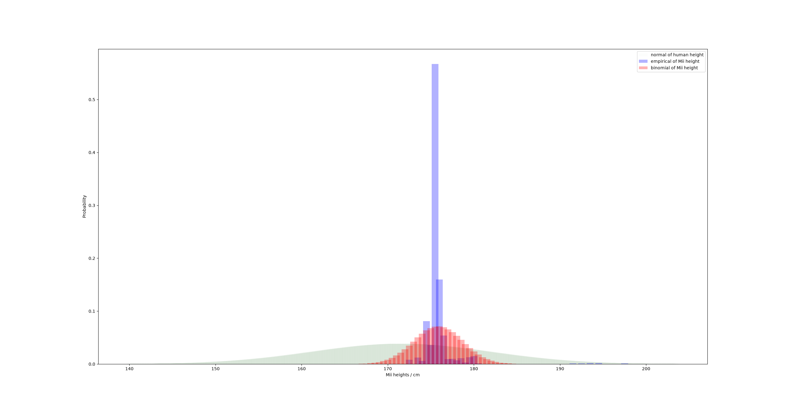
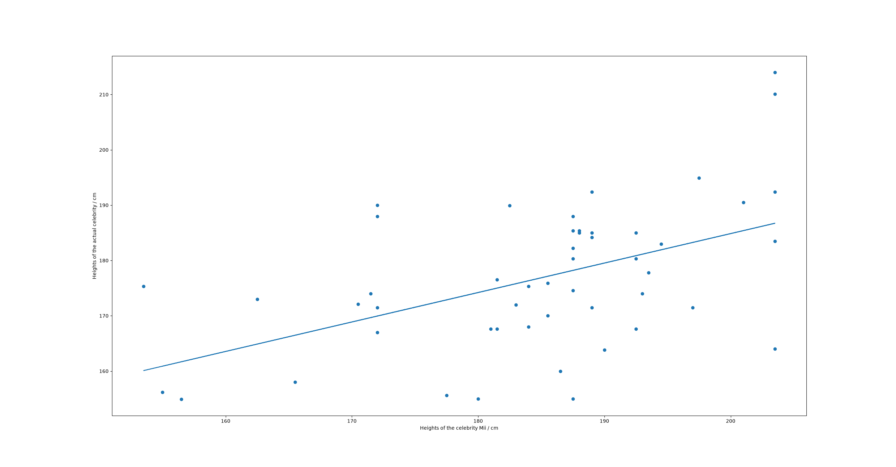
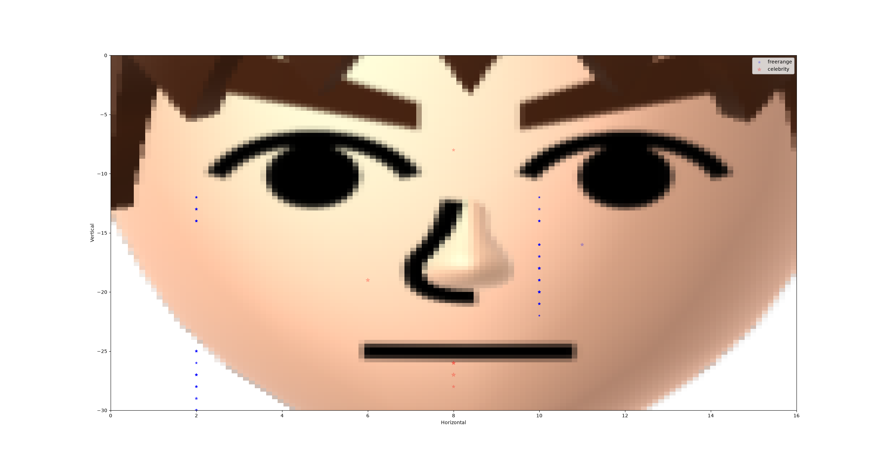

# mii-lion-dollar-question  
**Introduction**  
Between the birth of this project and its conclusion, I hope to see if there is a method to the madness of Mii creators across the world, specifically in two categories of Mii design.  
On one hand, we have the large set of StreetPass and data encompassing literally any Mii anyone could make ever, and on the other hand we accompany this with the smaller set of celebrity Miis.  
I think a few ideas already come to mind as to how you might expect this to go; for example, everyone should have quite a similar replica of Michael Jordan when sat at home designing him. It's also fair to say a lot of features on Mii makers are overlooked and will probably have a lesser variance than something like the favourite colour option, even if there are fewer values for this.  
I didn't start this project for nothing, though, so rather than auditing what we *think* will be the case, let's get to analysis.  
  
**N.B.** This might not look the cleanest at the moment though as it is a work in progress. As more progress is made, this page will look neater.  
**Findings**  
#### Exploratory data analysis of height
Plotted (as probability distributions) the empirical data, a horrible binomial approximation, and real life data worldwide from Our World in Data.  
Findings:  
- the variance is tiny on this data. a lot of people don't care enough to change the heights by that much, but it means using this already leptokurtic data, only 2.2% of these Miis are 180cm+ in human height. This means if you tried to use it to decide the height of a train, or a bus, an awful lot of people would bump their heads.  
- caveat: I got the height conversion from tomodachitools.com. There are other height converters like this which use a different scale which would skew my data (and you're free to edit that as you wish, although I have hardcoded it in some places and used a function in others, which is on me) and also most casual players won't know of such a height converter. Good chance they're eyeballing like crazy.  
- very few insane outliers i.e. 0 or 127. There are a few 100+ heights but this makes sense as a young boy on his Wii U might want to appear like the main character of WaraWara Plaza.  
- to do: KL divergence between the three distributions plotted. I want to see just how bad of a predictor the binomial model is.

#### Celebrity EDA - how good are humans at height predictions?
Not the worst ever. But not reliable. But that's fine. We're human.  
At the 1% significance level, the p value is way too low for there not to be a positive correlation. That means humans are better than chance is at getting a Mii's height right. It makes sense, as you would probably make Michael Jordan taller than Markiplier when making them both as Miis, or you might not change their heights at all. You wouldn't make MJ shorter, though, would you?  
Anyways, here are some cool findings.  
R^2 = 0.252 to 3sf. That isn't horrible for the social sciences (which I guess is what this data falls into) but we aren't perfect. Here's why we can't be, just looking at the data:  
- Shaq is taller than 203.5cm, but that's also the maximum height you can set your Mii! You can't get that right, so by counterexample y=x can never be a regression line.  
- Some Miis, like Snoop Dogg, were added twice. These are two separate interpretations of the celebrity, so that means their heights are different. Hence by counterexample you cannot draw a straight line plotting all these points.  
- Nobody actually knows; again, we are all eyeballing. We shouldn't expect R^2=1 anyway!  
- Some heights had to be guessed which makes it even harder! For example, Tom from Eddsworld does not have a height that is well-documented, so I had to dig a bit to find an estimation that sounded about right.  
Here is the PMCC, R^2, and its p value  
| statistic | value |
|---------|---------|
| PMCC | 0.502172500180734 |
| R^2 | 0.2521772199377693 |
| p-value | 0.00020255114987027697 |
  
Here is the line data  
y = 0.5326643310810989x + 78.32355133594265  
So yeah. People aren't the worst at guessing the heights of their GOATs... but by no means are they the best, either!

#### Holy spaghetti code  
By far the coolest graphs are here but also the worst code...  
I cleaned any weird looking data (and trust me there was a lot of dirty data. Idk how it got there but it's dirty.)  
by using the 3DBrew Mii specification. The plots also have an image for guidance on where the mole might go on a real Mii.  
**NNID Miis (210)**  
| statistic | x (horizontal) | y (vertical) | s (size) |
|-----------|---------------|--------------|----------|
| mean      | 6.842857      | -18.842857   | 1.828571 |
| std       | 3.925024      | 5.381083     | 1.048646 |
| min       | 2.000000      | -30.000000   | 0.000000 |
| 25%       | 2.000000      | -21.000000   | 1.000000 |
| 50%       | 10.000000     | -17.500000   | 2.000000 |
| 75%       | 10.000000     | -14.000000   | 3.000000 |
| max       | 11.000000     | -12.000000   | 5.000000 |
  
**Celebrity Miis (6)**  
| statistic | x (horizontal) | y (vertical) | s (size) |
|-----------|---------------|--------------|----------|
| mean      | 7.666667      | -22.333333   | 5.833333 |
| std       | 0.816497      | 7.711463     | 2.041241 |
| min       | 6.000000      | -28.000000   | 4.000000 |
| 25%       | 8.000000      | -26.750000   | 4.000000 |
| 50%       | 8.000000      | -26.000000   | 5.500000 |
| 75%       | 8.000000      | -20.750000   | 7.750000 |
| max       | 8.000000      | -8.000000    | 8.000000 |
  
The EDA says this for the NNID and celebrity Miis. Just at a glance you can see the mean Manhattan distance is larger on the celebrity Miis, and to be fair only 6 celebrity Miis had valid moles, but still a noteworthy finding for later.  
This program plots where the moles go on the face and we can kinda see some patterns that emerge. I see some clusters here that look pretty interesting... but do those clusters actually exist, or is it all in my head?  
Using the elbow method, I found out wrongly that we need 3 clusters, and correctly that I needed 2! Stupid mistake but it was my first time deploying this method, so I'm not too angry at myself for it. I can see me forgiving myself in like a couple of months.  
However, there's a chance I should forgive myself a little sooner because I think I accidentally found findings that tell more of a story IMO.  
For the 2 clusters, the narrative seemed to be distance from the nose, which in my data usually meant closer to the top-right corner. A bit boring, but reliable. I was hoping to be able to differentiate between moles that were used as actual moles as opposed to moles used to "decorate" a Mii or accompany the other parts of its face.  
Using 3 clusters told me a lot more of a story. The clusters seemed to come in 3: the first one would be all the moles either side of the nose, which seems like a likely place for a mole to be. The second one included the moles around the eyes, which is a bit rarer and could be fair enough but could also be eye decoration - I know my celebrity Miis and as such I know one is Frida Kahlo, where the mole did in fact accompany the eye. The third cluster just seemed like a really weird place to have a mole, and I knew from my celebrity Miis most were to decorate the mouth... but I think some were just because it looked funny having it off the Mii. The moles move in 2D, after all, but the face is 3D.  
Pretty fun!

